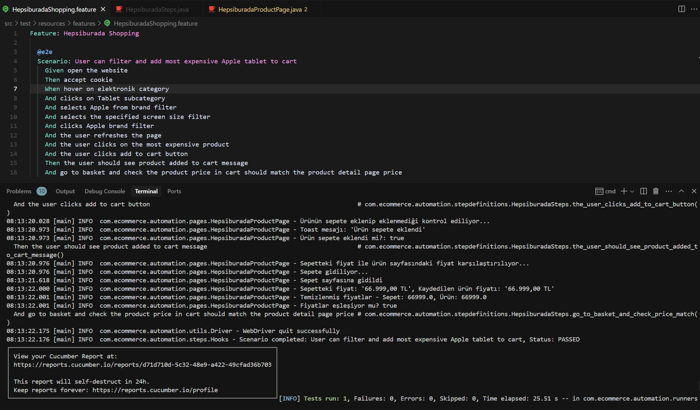

# E-Ticaret Otomasyon Projesi



Not: Projeyi daha sürdürülebilir kurgulayabilirdim. Örneğin selectorleri ayrı klasörlerde toplayabilir, tüm kullanacağım base fonksiyonları utils/action ve /check altında tanımlayıp(Örn: click, check, getText) kendi yönetilebilir fonksiyonlarımı oluşturabilirdim. Fakat mevcut işimde teslimat haftasında olduğumuz için çok kısa vakit ayırabildim elimden gelen en iyisini yapmaya çalıştım. Ayrıca iki projeyi de cursor destekli yazdığımı da belirtmek istiyorum.

Bu proje, Cucumber BDD ve Selenium WebDriver kullanılarak Java'da geliştirilmiş bir e-ticaret otomasyonudur. Proje, paralel ve cross-browser testleri destekler.

## Özellikler

- Page Object Model (POM) tasarım deseni
- Cucumber BDD kullanarak senaryoların okunabilir formatta yazılması
- Cross-browser testing (Chrome ve Firefox)
- Paralel test çalıştırma
- Thread.sleep() yerine explicit wait kullanımı
- Log4j2 kullanarak loglama
- Screenshot alma
- Maven kullanarak bağımlılık yönetimi

## Gereksinimler

- Java JDK 17 veya üzeri
- Maven 3.6.3 veya üzeri
- Chrome ve Firefox tarayıcıları

## Proje Yapısı

```
src/
├── main/
│   ├── java/
│   │   └── com/
│   │       └── ecommerce/
│   │           └── automation/
│   │               ├── pages/        # Page Object sınıfları
│   │               └── utils/        # Yardımcı sınıflar
│   └── resources/                    # Konfigürasyon dosyaları
│       ├── config.properties
│       └── log4j2.xml
└── test/
    ├── java/
    │   └── com/
    │       └── ecommerce/
    │           └── automation/
    │               ├── runners/      # Test çalıştırıcı sınıflar
    │               └── steps/        # Cucumber adım tanımlamaları
    └── resources/
        └── features/                 # Cucumber özellik dosyaları
```

## Testleri Çalıştırma

### Normal Çalıştırma

```bash
mvn clean test
```

### Tek Test Çalıştırma

```bash
mvn test -DsingleTest=HepsiburadaShopping.feature
```

### Parallel Çalıştırma

Maven ile paralel çalıştırma:
```bash
mvn clean test -Dtest=ParallelTestRunner
```

Batch betiği ile paralel çalıştırma (Chrome ve Firefox aynı anda):
```bash
run-parallel-tests.bat
```

Batch içeriği:
```batch
@echo off
echo *** Paralel Test Çalıştırıcı ***
echo Chrome ve Firefox testleri paralel olarak başlatılıyor...

start cmd /k "mvn test -Dtest=ChromeIT"
start cmd /k "mvn test -Dtest=FirefoxIT"

echo İki test de farklı pencerelerde başlatıldı.
echo Test sonuçlarını her bir pencerede görebilirsiniz.
```

## Raporlar

Test raporları, aşağıdaki konumda oluşturulur:

```
target/cucumber-reports/
```

## Konfigürasyon

Tarayıcı seçimi ve diğer parametreler `src/main/resources/config.properties` dosyasından yapılandırılabilir:

- Chrome tarayıcısını kullanmak için: `browser.type=chrome`
- Firefox tarayıcısını kullanmak için: `browser.type=firefox`
- Test edilecek URL: `base.url=https://www.hepsiburada.com`

## Notlar

- Thread.sleep() yerine explicit wait kullanılmıştır
- Cross-browser testing için her iki tarayıcı da ayrı test runner'larla çalıştırılabilir
- Paralel çalıştırma özelliği iki tarayıcıyı aynı anda çalıştırır 
